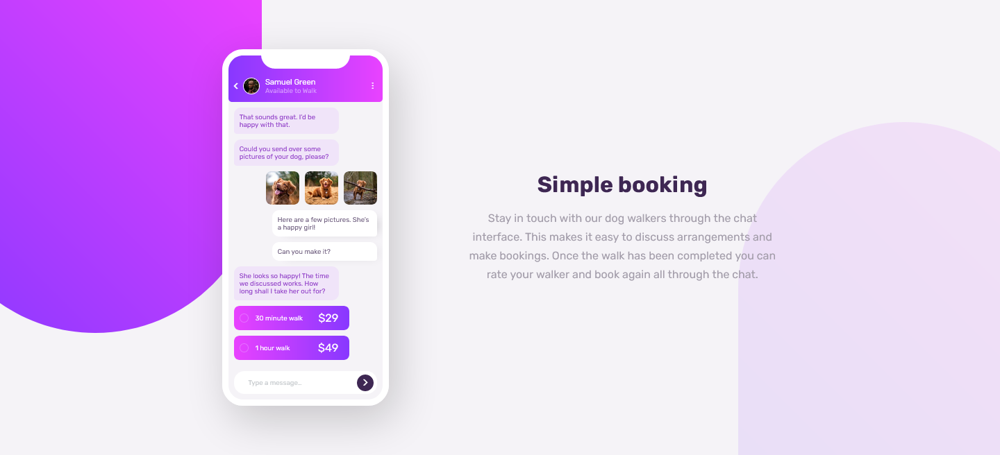
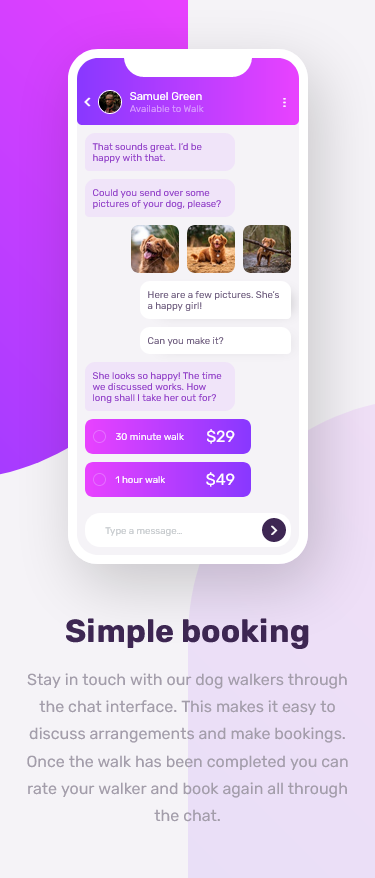

# Frontend Mentor - Chat app CSS illustration solution

This is a solution to the [Chat app CSS illustration challenge on Frontend Mentor](https://www.frontendmentor.io/challenges/chat-app-css-illustration-O5auMkFqY). Frontend Mentor challenges help you improve your coding skills by building realistic projects. 

## Overview

### The challenge

Users should be able to:

- View the optimal layout for the component depending on their device's screen size

### Links

- [Live Site URL](https://codepapa360.github.io/chat-app-css-illustration-master/)
- [Solution URL](https://www.frontendmentor.io/solutions/beautiful-chat-app-css-illustration-G9lHp_ECUA)

### Screenshot

#### Desktop preview

#### Mobile preview 

## My process

### Built with

- Semantic HTML5 markup
- CSS custom properties
- Flexbox
- Mobile-first workflow

## Author

- Frontend Mentor - [@CodePapa360](https://www.frontendmentor.io/profile/CodePapa360)
- Twitter - [@CodePapa360](https://www.twitter.com/CodePapa360)
- LinkedIn - [@CodePapa360](https://www.linkedin.com/in/codepapa360)
